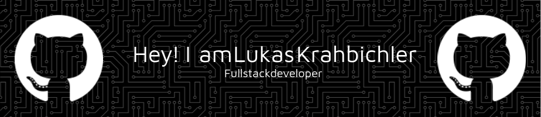

---

## 👤 **About Me**

Hello! I'm an electronics and IT enthusiast from Austria. I enjoy bringing ideas to life through software and hardware development.

* **🔭 Currently working on:** [Amoginarium](https://github.com/Nilusink/amoginarium)
* **🎓 Education:** I completed my *Matura* in *Electronics and Technical Information Technology* at *HTL-Anichstraße* in *Innsbruck, Austria*.
* **💼 Core Skills:** My main focus areas include **Python** 🐍, **Web Development (Angular)** 🌐, **Database Management** 🗄️, and **VHDL** 🛠️.
* **🔧 Hardware & Design Tools:** I have strong experience in schematic design, circuit simulation, and PCB design using **Altium Designer**, alongside 3D modeling using **Autodesk Inventor** and **PTC Creo**.
* **🌍 Languages:** Proficient in **English** and **German**.

## 💻 Tech Stack & Tools

### 🔠 Languages

  
  
  
  
  
  
  
  
  
  
  
  
  
  

### 📚 Frameworks & Libraries

  
  
  
  
  

### 🛠️ Tools & Platforms

  
  
  
  
  
  
  
  
  
  
  
  
  
  
  
  
  
  
  
  
  
  

### 💻 IDEs & Editors

  
  
  
  
  
  
  

---

## 🤝 Let's Connect

  
  

