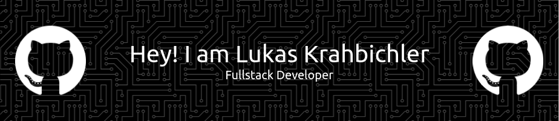

  

## <picture></picture> **About me**

- **🎓 Learning:** I am currently pursuing education in _Electronics and Technical Information Technology_ at _HTL-Anichstraße_ in _Innsbruck_, _Austria_.
- **🖥️ IDEs:** I primarily use _JetBrains IDEs_ and _VSCode_ for my development work.
- **💼 Skills:** My core competencies include _Python_ 🐍, _Web Development_ with _Angular_ 🌐, _Databases_ 🗄️, and _VHDL_ 🛠️.
- **🔧 Tools:** I have extensive experience in _schematic design_, _circuit simulation_, and _PCB_ design using _Altium_, as well as _3D design_ using _Inventor_ and _Creo_.
- **🌍 Languages:** I am proficient in _English_ and _German_.

    

## <b> Skills</b>

<table align="center">
  <tr>
    <th>Languages</th>
    <td>
      
    </td>
  </tr>
  <tr>
    <th>Libraries / Frameworks</th>
    <td>
      
    </td>
  </tr>
  <tr>
    <th>Tools</th>
    <td>
      <a href="https://skillicons.dev">
        
         
        
      </a>
    </td>
  </tr>
  <tr>
    <th>IDEs</th>
    <td>
      
    </td>
  </tr>
</table>

    

## 🌟 Projects

  

    

## 📈 GitHub Stats

<!--- stats & Trophy (start) -->

  <!--- stats (start) -->
<table align="center" width="100%>
<tr border="none">
<td width="50%" align="center">
  
  
    
   
</td>

<td width="50%" align="center">

  
  
  </td>
</tr>
</table>
<!--- stats (end) -->

<!--- trophy (start) -->

  

<!--- trophy (start) -->

    

## 🤝 Connect with me

 

        
        
	
      

    

